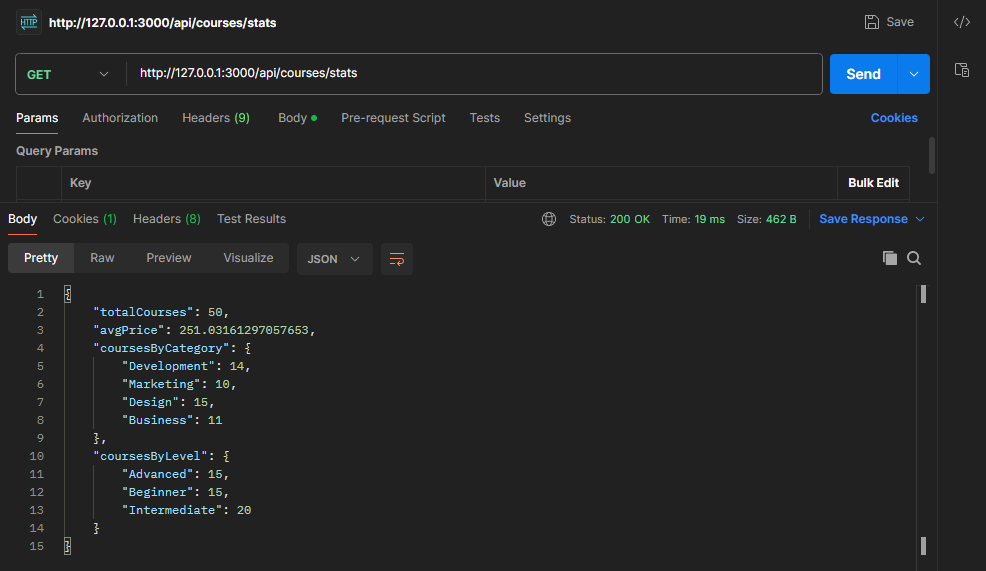

#1. Comment installer et lancer le projet:

            1.Comment installer et lancer le projet
               #Cloner le projet
               git clone https://github.com/pr-daaif/learning-platform-template.git

               #Renommez le dépôt origin
               cd learning-platform-template
               git remote remove origin

               # Ajoutez votre dépôt comme nouvelle origine
               git remote add origin https://github.com/[votre-compte]/learning-platform-nosql

               # Poussez le code vers votre dépôt
               git push -u origin main

            2. Installer les dépendances avec
               `npm install`

            3. Lancer le projet avec
               `npm start`

#2. La structure du projet
Le projet est composé de 3 dossiers principaux :

            - env : contient les variables d'environnement
            -package.json : contient les packages utilisés dans le projet
            - src :

                        - controllers : contient les controlleurs de l'application
                                 -courseController.js : controlleur de la route /course

                        - routes : contient les routes de l'application
                                 -courseRoutes.js : route /course
                        - services : contient les services de l'application
                                 -mongoService.js : service de connexion à la base de données
                                 -redisService.js : service de connexion à redis(cache)

            - app.js: fichier principal de l'application

#3. Les choix techniques que vous avez faits

      Node.js avec Express.js :
         Un framework léger et rapide pour construire des APIs REST.
      MongoDB :
         Base de données NoSQL choisie pour sa flexibilité et sa capacité à gérer des
         données semi-structurées, idéale pour une plateforme éducative où les structures de données
         peuvent varier.
      Redis :
         Utilisé pour mettre en cache les données fréquemment consultées, comme
         les informations des cours, afin d'améliorer la vitesse de réponse de l'API et de réduire
         la charge sur MongoDB.
      Postman :
         Utilisé pour tester, déboguer et valider les endpoints de l'API, garantissant
         ainsi une bonne couverture de tests sur les fonctionnalités essentielles.

#4. Les réponses aux questions posées dans les commentaires

    4.1 les questions de db.js

          Question:
             Pourquoi créer un module séparé pour les connexions aux bases de données ?
          Réponse:
             on peut cree tous les connexions dans un seul fichier mais il est plus propre
             de les separer pour une meilleur lisibilite et facilite de maintenance
             aussi l'operation de connexion peut etre coteuse en performance lorsqu'on cree une connexion a chaque fois
             Si on utilise des connexions multiples on va charger notre processeur en notr memoire .

          Question :
             Comment gérer proprement la fermeture des connexions ?
          Réponse :
             On doit fermer les connexions lorsqu'on a fini de les utiliser pour liberer les ressources(memorie,cpu)

    4.2 les questions de env.js.

          Question:
             Pourquoi est-il important de valider les variables d'environnement au démarrage ?
          Réponse:
             Il est essentiel de valider les variables d'environnement pour s'assurer que toutes
             les configurations nécessaires sont fournies avant le démarrage de l'application.
             Cela évite des erreurs inattendues ou des comportements imprévisibles.
          Question:
             Que se passe-t-il si une variable requise est manquante ?
             Si une variable d'environnement requise est absente l'application risque de ne pas démarrer
             correctement, de mal se connecter aux services ou de produire des erreurs pendant l'exécution.

    4.3 les questions courseController.js

         Question:

            Quelle est la différence entre un contrôleur et une route ?

         Réponse:
               Route :
                  C'est une configuration qui définit l'URL et la méthode HTTP (GET, POST, etc.)
                  pour une action spécifique de l'application.Elle détermine quel contrôleur et quelle
                  fonction doivent être exécutés lorsqu'un utilisateur fait une requête vers cette URL.

               Contrôleur :
                   C'est un fichier ou un module qui contient la logique métier pour traiter la requête.
                   Il reçoit les données de la requête.

         Question :
            Pourquoi séparer la logique métier des routes ?

         Réponse :
             Réutilisation : Une même logique métier peut être utilisée dans plusieurs routes ou même
             dans d'autres parties de l'application, ce qui évite de dupliquer le code et simplifie
             les évolutions futures

    4.4 les questions de courseRoutes.js

         Question:
            Pourquoi séparer les routes dans différents fichiers ?

         Réponse:
            Séparer les routes dans différents fichiers permet de mieux organiser le code et de le rendre
            plus modulaire et facile à maintenir. Cela permet également de réutiliser les routes dans
            d'autres parties de l'application ou de les partager entre plusieurs applications.

         Question:
            Comment organiser les routes de manière cohérente ?

         Réponse:
           Les routes peuvent être organisées en fonction de leur domaine fonctionnel ou de leur
           relation logique. Par exemple, toutes les routes liées à la gestion des utilisateurs
           peuvent être regroupées dans un fichier userRoutes.js, tandis que les routes liées
           à la gestion des produits peuvent être regroupées dans un fichier productRoutes.js.

    4.5 les question de mongoService.js

         Question:
            Pourquoi créer des services séparés ?

         Réponse:
            Créer des services séparés permet de structurer le code de manière claire et modulaire.
            Cela facilite la maintenance, la réutilisation des fonctionnalités et le débogage.
            Chaque service est responsable d'une tâche spécifique, ce qui réduit les dépendances
            et améliore la lisibilité. De plus, cela favorise l'évolutivité en permettant d'ajouter
            ou de modifier des fonctionnalités sans impacter l'ensemble du projet.

    4.6 les questions de redisService.js
         Question:
            Comment gérer efficacement le cache avec Redis ?
         Réponse:
            Définir un TTL pour les clés mises en cache :
               Assurez que chaque clé a une durée de vie limitée pour éviter d'accumuler des données obsolètes.
            Mettre en œuvre la stratégie "Cache-aside" :
               Stockez les données fréquemment utilisées dans le cache et chargez-les uniquement
               lorsqu'elles ne sont pas disponibles en cache.
            Mettre à jour ou invalider le cache après les modifications :
               Supprimez ou rafraîchissez les clés en cache immédiatement après une mise à jour
               dans la base de données.

    4.7 les questions de app.js
         Question:
             Comment organiser le point d'entrée de l'application ?
         Réponse:
             Centralisez le point d'entrée dans un fichier unique (par ex. `index.js` ou `main.js`)
             qui importe les dépendances nécessaires, configure les services, et démarre l'application.
             Maintenez une structure claire pour séparer les responsabilités (routes, logiques métiers, etc.).

         Question:
             Quelle est la meilleure façon de gérer le démarrage de l'application ?
         Réponse:
             Utilisez une fonction dédiée au démarrage (par ex. `startApp()`) pour initialiser
             les configurations (environnement, base de données, etc.),gérer les erreurs, et lancer
             les serveurs ou autres processus nécessaires.

#5. API Testing Examples

Example 1: Fetch a Course

Example 2: Get Course Statistics

Example 3: create course

Example 4: get all courses

